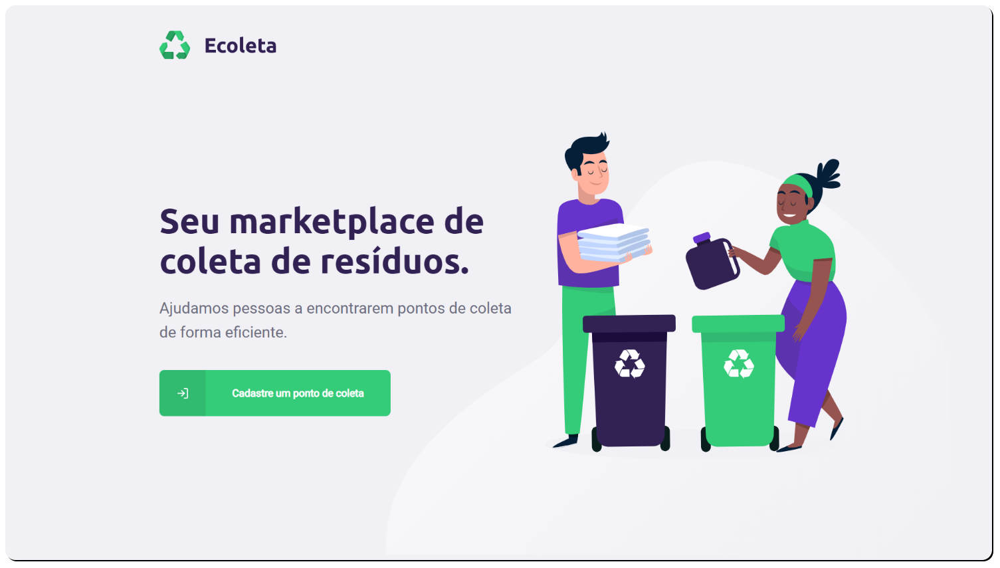
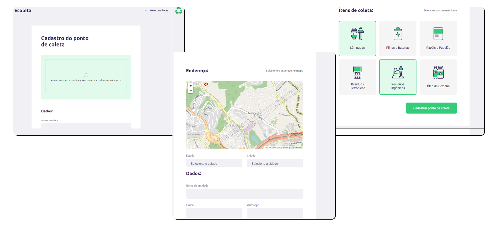
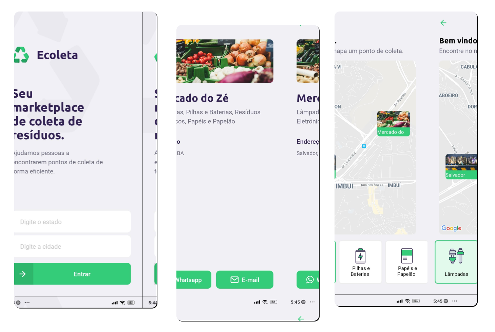

<p align="center" >

<a href="https://www.linkedin.com/in/urquiza-n%C3%B3brega-b999a1105/"></a>
</p>
<h1 align="center">Ecoleta</h1>
<p align="center">Tornando o mundo melhor colaborando com a coleta de resíduos</p>

<h5 align="center"> 🚀 Projeto finalizado 🚀 </h5>

Tabela de conteúdos
=================
<!--ts-->
   * Telas
      * [Web](#telas)
      * [Mobile](#mobile)
   * [Funcionalidades](#funcionalidades)
   * [Tecnologias utilizadas](#tecnologias-utilizadas)
   * Instalação
      * [Pré requisitos](#pré-requisitos)
      * [Server](#server)
      * [Web](#web)
      * [Mobile](#mobile)
<!--te-->

## Telas
### Web



### Mobile


## Funcionalidades
- As entidades podem realizar o cadastro através na plataforma Web:
  - Inserir imagem da entitade, e-mail e WhatsApp
  - Selecionar no mapa a localização
  - Selecionar estado e cidade
  - Selecionar os ítens de coleta:
    - Lâmpadas
    - Pilhas e baterias
    - Papéis e papelão
    - Resíduos eletrônicos
    - Resíduos orgânicos
    - Óleo de cozinha

- Através do aplicativo os usuários poderão:
  - Buscar pontos de coleta próximos na sua cidade
  - Entrar em contato com as entidades por:
    - WhatsApp
    - E-mail

## Tecnologias utilizadas
- [x] React
- [x] React Native
- [x] Javascript
- [x] Expo
- [x] NodeJS
- [x] TypeScript
- [x] SQLite3
- [x] KnexJS
- [x] Express
- [x] Celebrate Joi

## Instalação

### Pré-requisitos
Você precisa ter instalado em sua máquina as seguintes ferramentas:
- [Git](https://git-scm.com)
- [Node.js](https://nodejs.org/en/) 

### 🎲 Clonando o repositório

```bash
# Clone este repositório
$ git clone <https://github.com/UrquizaN/ecoleta-react>

# Acesse a pasta do projeto no terminal/cmd
$ cd ecoleta-react
```
### 🚦 Configurando e rodando o SERVER

```bash
# Acesse a pasta server no terminal/cmd
$ cd server

# Instale as dependências
$ npm install
ou
$ yarn install

# Criar o banco de dados e alimentar
$ npm run knex:migrate
$ npm run knex:seed
ou
$ yarn run knex:migrate
$ yarn run knex:seed
```

🚨 <strong> Vá até a pasta controllers e alterar o IP da image_url dentro dos arquivos ItemsController.ts e PointsController.ts </strong> 🚨

```bash
# Executar o servidor
$ npm run dev
ou 
$ yarn dev

```

### 🌐 Configurando e executando a versão WEB
🚨 É imprescindível ter executado os passos anteriores e estar com o <strong> SERVER </strong> rodando 🚨
```bash
# Acesse a pasta web no terminal/cmd
$ cd web

# Instale as dependências
$ npm install
ou 
$ yarn install

# Execute o projeto
$ npm start
ou 
$ yarn start

# O servidor inciará na porta:3000 - acesse <http://localhost:3000>
```

### 📱 Configurando e executando a versão MOBILE
```bash
# Acesse a pasta web no terminal/cmd
$ cd mobile

# Instale as dependências
$ npm install
ou
$ yarn install
```
🚨 </strong> Ir até a pasta services e alterar o IP da baseURL dentro do arquivo api.tsx </strong> 🚨
```bash
# Execute o projeto (Android)
$ npm andoid
ou
$ yarn android


# Execute o projeto (iOS)
$ npm ios
ou
$ yarn ios
```

<p  align="center">Projeto <strong>Ecoleta</strong> desenvolvido durante a Next Level Week #01 da <a  href="https://rocketseat.com.br">Rocketseat</a>. Ministrado por <a href="https://github.com/diego3g"> Diego Fernandes </a></p>


<h3 align="center">
💻 Desenvolvido por: Urquiza Nóbrega
</h3>
